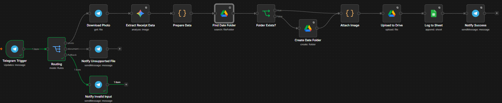
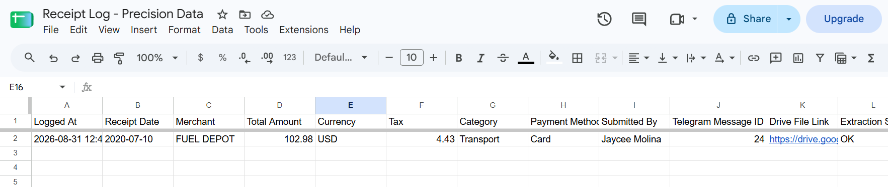
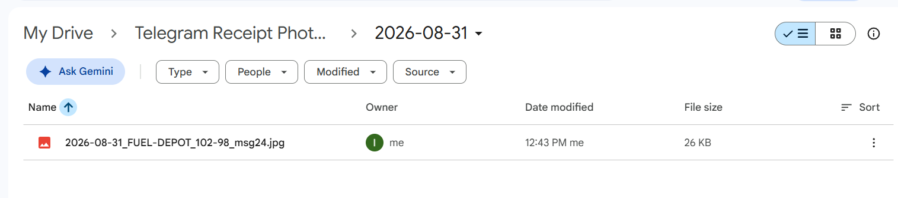
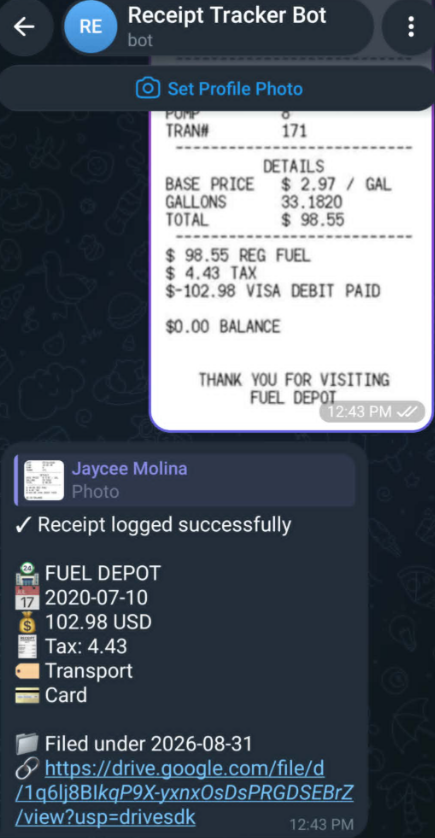
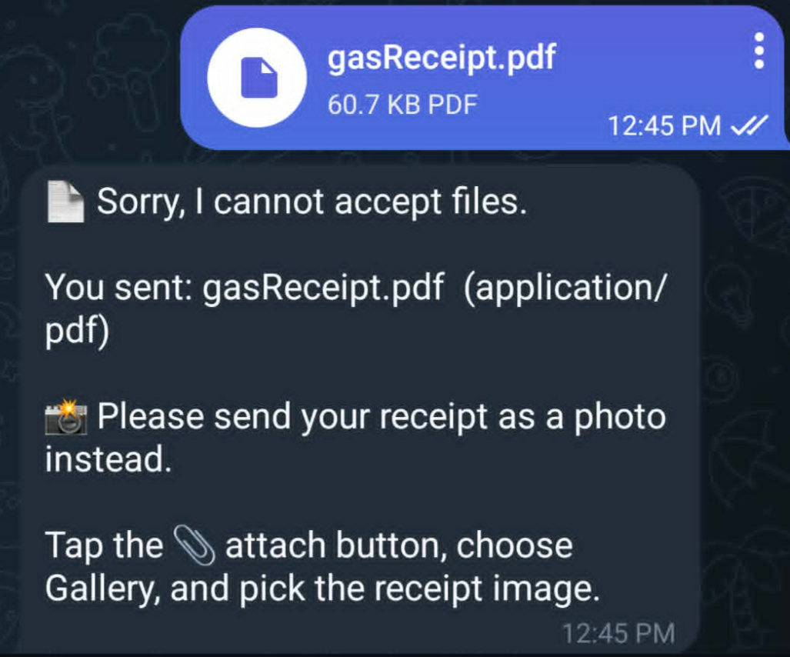
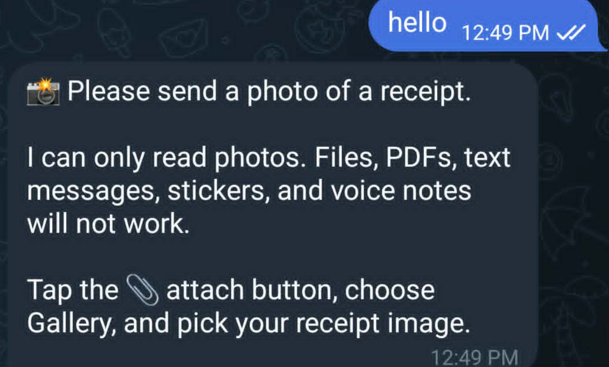

# Telegram Receipt Photo Processing — n8n

An n8n workflow that turns receipt photos sent to a Telegram bot into structured spreadsheet rows and a dated Google Drive archive, using Google Gemini for extraction.

Built for the Precision Data Solutions AI Developer assessment (Workflow 2).

**Stack:** n8n Cloud · Telegram Bot API · Google Gemini `gemini-3.5-flash` · Google Sheets · Google Drive

---

## What it does

1. Accepts a receipt photo sent to a Telegram bot
2. Extracts merchant, date, amount, tax, currency, category, and payment method with Google Gemini
3. Validates and normalises every field before storage
4. Appends a row to Google Sheets
5. Uploads the original photo to Google Drive, in a folder named for the submission date
6. Replies in Telegram with a summary and a link to the stored file

Non-photo input is answered with guidance rather than being silently discarded.

---

## Architecture



```
Telegram Trigger
      │
   Routing (Switch)
      ├─ photo ────→ Download Photo → Extract Receipt Data → Prepare Data
      │                                                            │
      │                                                    Find Date Folder
      │                                                            │
      │                                                     Folder Exists?
      │                                              ┌── true ─────┴──── false ──┐
      │                                              │                  Create Date Folder
      │                                              └────────┬──────────────────┘
      │                                                  Attach Image
      │                                                       │
      │                                               Upload to Drive
      │                                                       │
      │                                                 Log to Sheet
      │                                                       │
      │                                                Notify Success
      │
      ├─ document ─→ Notify Unsupported File
      └─ Fallback ─→ Notify Invalid Input
```

| Node | Type | Role |
|---|---|---|
| `Telegram Trigger` | Telegram Trigger | Webhook, fires on new messages |
| `Routing` | Switch | Splits photo / document / everything else |
| `Download Photo` | Telegram | Exchanges `file_id` for image binary |
| `Extract Receipt Data` | Google Gemini | Analyze Image, returns strict JSON |
| `Prepare Data` | Code | Parses, validates, derives dates and filename |
| `Find Date Folder` | Google Drive | Searches for today's folder |
| `Folder Exists?` | If | Branches on the search result |
| `Create Date Folder` | Google Drive | Creates the folder only when absent |
| `Attach Image` | Code | Convergence point, re-attaches binary |
| `Upload to Drive` | Google Drive | Stores the photo with a generated filename |
| `Log to Sheet` | Google Sheets | Appends the row |
| `Notify Success` | Telegram | Threaded summary reply |
| `Notify Unsupported File` | Telegram | Rejects PDFs and other file types |
| `Notify Invalid Input` | Telegram | Handles `/start`, text, stickers, voice |

---

## Output

### Google Sheet



| Column | Source |
|---|---|
| Logged At | processing time, local timezone |
| Receipt Date | date printed on the receipt |
| Merchant | Gemini |
| Total Amount | Gemini, coerced to a number |
| Currency | ISO 4217 |
| Tax | Gemini, coerced to a number |
| Category | closed vocabulary |
| Payment Method | closed vocabulary |
| Submitted By | Telegram sender name |
| Telegram Message ID | deduplication key |
| Drive File Link | `webViewLink` from the upload |
| Extraction Status | `OK` or `NEEDS_REVIEW`, derived |

`Logged At` and `Receipt Date` are deliberately separate. A receipt printed in 2020 can be submitted today, and conflating the two destroys both the business date and the audit trail.

### Google Drive



```
My Drive/
└── Telegram Receipt Photo Processing/
    ├── 2026-08-30/
    └── 2026-08-31/
        └── 2026-08-31_FUEL-DEPOT_102-98_msg24.jpg
```

The parent folder is created once by hand; the dated subfolders are created by the workflow at runtime.

### Telegram

| Photo accepted | File rejected | Text rejected |
|---|---|---|
|  |  |  |

---

## Design decisions

### Idempotent folder creation

Google Drive allows duplicate folder names, so a blind `Create folder` produces one folder per receipt. The workflow searches first and creates only when nothing is found. Ten receipts in a day yield exactly one folder.

The search uses an explicit Drive query rather than the simple name filter:

```
name = '2026-08-31'
  and mimeType = 'application/vnd.google-apps.folder'
  and '<PARENT_FOLDER_ID>' in parents
  and trashed = false
```

Four constraints, each closing a specific hole: exact name match instead of `contains`, correct MIME type so a same-named file can't match, scoped to one parent so it can't find a folder elsewhere in Drive, and `trashed = false` — Drive keeps trashed items searchable, and uploading into a trashed folder makes the file silently invisible.

`Always Output Data` is enabled on the search node. Without it, a zero-result search emits no items and the branch halts with no error, losing the first receipt of every new day. With it, "not found" becomes an empty item the `If` node can actually test.

### Timezone-correct grouping

Telegram timestamps are UTC. A receipt submitted at 07:00 in Manila is 23:00 the previous day in UTC, so naive date handling files it under the wrong day — every morning, invisibly. Dates are formatted with `Intl.DateTimeFormat` pinned to an explicit timezone.

### AI output is treated as untrusted input

Gemini is a strong extractor but a probabilistic one, so a validation layer sits between the model and storage:

- amounts coerced to numbers, currency symbols and thousand separators stripped
- dates rejected unless they match `YYYY-MM-DD` exactly
- currency validated as a 3-letter ISO code
- category and payment method snapped to closed vocabularies, so `Fuel` and `Gas Station` cannot fragment a column that should group cleanly
- unparseable or truncated responses degrade to a flagged row instead of crashing the execution

### `Extraction Status` is derived, not reported

The status column is recomputed from the validated values rather than copied from Gemini's own `status` field. The model could claim `OK` while returning a malformed date that validation just nulled. Deriving it guarantees a row marked `OK` reflects what actually reached the sheet, and anything incomplete is flagged `NEEDS_REVIEW`.

A bad extraction is never allowed to look like a good one.

### Semantic rules in the prompt, structural rules in code

Code can verify that a date is well-formed. Only the model can read the printed address that disambiguates `07/10/2020` as July 10 in Nevada versus October 7 in Manila. So the prompt owns meaning — total versus subtotal, date locale, currency inference — and the Code node owns types and shape.

A worked example from the test receipt: it prints `TOTAL $98.55`, then `$4.43 TAX`, then `$-102.98 VISA DEBIT PAID`. The line labelled `TOTAL` is the pre-tax subtotal. The prompt instructs the model to prefer the payment line, so the extracted amount is `102.98` — the amount actually charged.

### Generated filenames

Telegram's photo pipeline re-encodes images and discards metadata, so every download arrives named `file_0.jpg`. Uploading that verbatim produces a Drive folder of indistinguishable files. Filenames are synthesised as `date_merchant_amount_messageID.ext`.

Merchant names come from an LLM reading an untrusted image, so they are sanitised to `[a-zA-Z0-9-]` before being used in a path. Unsanitised model output in a filename is a path traversal vector, not a cosmetic concern.

### Explicit unhappy paths

A Switch node discards unmatched items by default, which would silently swallow every `/start` and text message — the first thing any new user sends. A fallback output routes them to a reply, and a separate branch handles unsupported file types with a message that echoes the filename and MIME type back, so the user knows exactly what was rejected and why.

---

## Setup

### Credentials

| Credential | Used by |
|---|---|
| Telegram API | trigger, download, 3 notify nodes |
| Google Gemini(PaLM) API | `Extract Receipt Data` |
| Google Drive OAuth2 | folder search, create, upload |
| Google Sheets OAuth2 | `Log to Sheet` |

On n8n Cloud the Google credentials use Managed OAuth2 — click *Sign in with Google*, no Google Cloud project required. The Telegram token comes from [@BotFather](https://t.me/BotFather); the Gemini key from [Google AI Studio](https://aistudio.google.com/apikey), which has a free tier with no card required.

### Steps

1. Import `workflow/telegram-receipt-photo-processing.json`
2. Attach your own credentials to each node — the export contains references only, never secrets
3. Create a Drive parent folder and paste its ID into `Find Date Folder` and `Create Date Folder`
4. Create a Google Sheet with the columns listed above, tab named `Receipts`, and select it in `Log to Sheet`
5. Set `TZ` at the top of the `Prepare Data` Code node to your timezone
6. Activate the workflow

### Sheet formatting

- `Logged At` and `Receipt Date` → **Plain text**, so Sheets cannot reinterpret ISO dates by locale
- `Total Amount` and `Tax` → **Number**, so totals stay summable
- Freeze row 1

---

## Security

- No secrets are committed. The workflow export carries n8n credential names and IDs, never token values.
- Bot tokens and API keys live only in the n8n credential store — never in Code nodes, HTTP URLs, or expressions.
- The Drive folder and Sheet stay **Restricted**. Access is via OAuth as the owning account, so no link sharing is needed. The IDs in the export are inert without a valid token, and that remains true only while sharing stays private.
- AI-derived text is sanitised before use in filenames or paths.
- Retry-on-fail with backoff is enabled on every external API node, so transient rate limits and 5xx responses do not drop a receipt.

---

## Known limitations

- **Concurrency.** Two receipts arriving in the same second could each search, find nothing, and create a dated folder. The window is milliseconds and the impact is cosmetic; the fix is limiting workflow concurrency to 1.
- **Images only.** PDF receipts are rejected with guidance. Supporting them means a second branch into Gemini's `Analyze Document` operation — a deliberate scope boundary for a brief that specifies receipt *photos*.
- **Telegram compression.** Photos are re-encoded and downscaled by Telegram, which caps OCR resolution. Accepting images as files would bypass this at the cost of a second input path.
- **Re-processing.** Sending the same photo twice creates two rows and two Drive files. The `Telegram Message ID` column exists as the deduplication key for a pre-processing lookup.

---

## Repository layout

```
workflow/            n8n workflow export
prompts/             the Gemini extraction prompt, as plain text
telegram-messages/   the three Telegram reply templates
screenshots/         evidence of the workflow running
```
